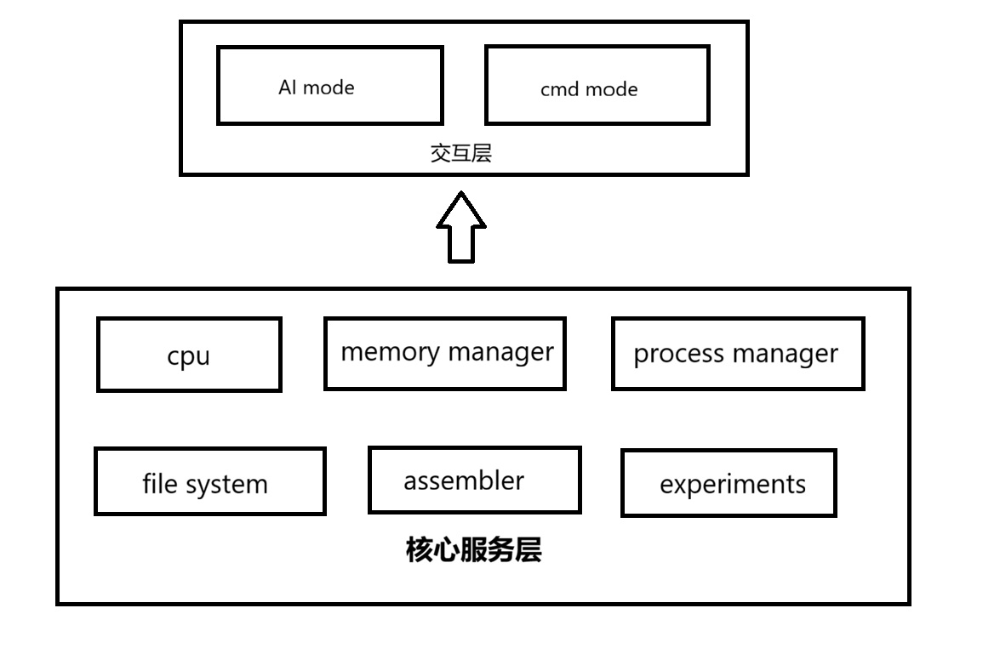

# LZY-OS 用户手册

## 文档信息

- **系统名称**: LZY-OS
- **版本号**: v2.1
- **编写日期**: 2025-12-31
- **作者**: 罗志远
- **联系方式**: 32315200057@e.gzhu.edu.cn

> 注：v2.1版本相较于课堂演示版本整体更简洁，按照linux命令行风格进行了大量的修改

## 1. 系统概述

### 1.1 什么是LZY-OS？

**LZY-OS** 是一个现代化的操作系统，集成了CPU模拟、进程管理、内存管理和文件系统等核心功能。提供了一个类似于Linux的命令行界面，让用户可以按照最熟悉的方式使用本操作系统，虽然整体仍较为简陋，但是在LAB1至LZB7的实验基础上又增添了很多功能。更为重要的是它对ai与操作系统的融合做了初步的尝试，虽然经过测试后效果不尽如人意，但在最开始的时候还是令我自己眼前一亮，后续仍有极大的优化空间，或许可以在一个简单的CPU上真正的尝试一次。*maybe是实现jarvis的第一步？*

### 1.2 系统架构



```
LZY-OS/
├── main.py                 # 主程序入口
   ─ __init__.py             # 包初始化
   ─ requirements.txt        # 依赖声明
   ─ run.bat                 # Windows启动

├── core/                   # 核心模块
   ─ __init__.py
   ─ cpu.py                 # CPU模拟器

├── modules/                # 功能模块
   ─ __init__.py
   ─ process_manager.py     # 进程管理
   ─ memory_manager.py      # 内存管理
   ─ file_manager.py        # 文件系统

├── utils/                  # 工具模块
   ─ __init__.py
   ─ ai_assistant.py        # AI助手
   ─ assembler.py           # 汇编器
   ─ experiments.py         # 实验演示
```

### 1.3 功能特性

- **功能**：CPU、进程、内存、文件系统四大核心模块
- **交互**：类Linux命令行提示符和实时反馈，通用、简洁
- **演示**：内置实验课所有的实验（具体演示指令请查看“操作指令集合.md”）
- **扩展**：模块化设计，便于二次开发和修改

---

## 2. 安装与运行

### 2.1 系统要求

| 要求项     | 规格                    |
| ---------- | ----------------------- |
| Python版本 | 3.7 或更高              |
| 操作系统   | Windows / Linux / macOS |
| 内存       | 至少 50MB RAM           |
| 存储       | 至少 10MB 磁盘空间      |

### 2.2 安装步骤

##### 步骤1：获取源代码

将LZY-OS文件夹放在合适的位置，例如：

```
f:\OS_Lab\lab8\LZY-OS\
```

##### 步骤2：验证Python安装

打开命令行（Windows按 `Win+R`输入 `cmd`，Linux/Mac打开终端），输入：

```bash
python --version
```

应该看到类似输出：

```
Python 3.8.10
```

如果显示命令未找到，请先安装Python。

##### 步骤3：进入项目目录

```bash
cd f:\OS_Lab\lab8\LZY-OS
```

### 2.3 运行系统

**Windows用户** - 在命令行输入：

```bash
python main.py
```

**Linux/Mac用户** - 在终端输入：

```bash
python3 main.py
```

### 首次运行

成功运行后，您会看到欢迎界面：

```
============================================================
  LZY-OS v2.1 - Operating System
  Type 'help' for commands, '/mode' to toggle AI mode
============================================================
[init] Loading AI assistant...
[ai] API connected
[init] AI status: online

lzy-os[ai]$
```

此时系统已成功启动，您可以开始输入命令。

---

## 3. 命令参考手册

> 完整指令集合参照“操作指令集合.md”

### 3.1 系统信息命令

#### `sysinfo` - 显示系统信息

**功能描述**：显示LZY-OS的详细系统信息

**语法格式**：

```bash
sysinfo
```

**使用示例**：

```bash
lzy-os[cmd]$ sysinfo
```

#### `cpuinfo` - 显示CPU信息

**功能描述**：显示CPU的当前状态，包括寄存器值和程序计数器

**语法格式**：

```bash
cpuinfo
```

**使用示例**：

```bash
lzy-os[cmd]$ cpuinfo
```

#### `meminfo` - 显示内存信息

**功能描述**：显示当前内存分配情况，包括已用和空闲内存

**语法格式**：

```bash
meminfo
```

**使用示例**：

```bash
lzy-os[cmd]$ meminfo
```

#### `fsinfo` - 显示文件系统信息

**功能描述**：显示文件系统的当前状态

**语法格式**：

```bash
fsinfo
```

**使用示例**：

```bash
lzy-os[cmd]$ fsinfo
```

---

### 3.2 文件系统命令

#### `ls` - 列出目录内容

**功能描述**：列出指定目录下的所有文件和子目录

**语法格式**：

```bash
ls [path]
```

**参数说明**：

- `[path]` - 可选，目录路径。如果不指定，默认列出当前目录

#### `cd` - 改变当前目录

**功能描述**：改变当前工作目录

**语法格式**：

```bash
cd <path>
```

**参数说明**：

- `<path>` - 必需，目标目录路径（绝对路径或相对路径）

#### `pwd` - 显示当前目录路径

**功能描述**：显示当前工作目录的完整路径

**语法格式**：

```bash
pwd
```

#### `mkdir` - 创建目录

**功能描述**：创建新目录

**语法格式**：

```bash
mkdir <path>
```

**参数说明**：

- `<path>` - 必需，新目录的路径

#### `touch` - 创建文件

**功能描述**：创建新文件或更新文件时间戳

**语法格式**：

```bash
touch <path>
```

**参数说明**：

- `<path>` - 必需，新文件的路径

#### `cat` - 显示文件内容

**功能描述**：读取并显示文件的内容

**语法格式**：

```bash
cat <path>
```

**参数说明**：

- `<path>` - 必需，文件路径

#### `echo` - 写入文件内容

**功能描述**：将文本写入文件

**语法格式**：

```bash
echo <path> <content>
```

**参数说明**：

- `<path>` - 必需，文件路径
- `<content>` - 必需，要写入的内容

**使用示例**：

```bash
lzy-os[cmd]$ echo /home/test.txt "Hello, World!"
lzy-os[cmd]$ echo /tmp/data/config.txt "Setting value = 100"
```

#### `rm` - 删除文件

**功能描述**：删除指定的文件

**语法格式**：

```bash
rm <path>
```

**参数说明**：

- `<path>` - 必需，要删除的文件路径

---

### 3. 3 进程管理命令

#### `run` - 运行程序

**功能描述**：运行预定义的程序（通过CPU执行）

**语法格式**：

```bash
run <program>
```

**参数说明**：

- `<program>` - 必需，程序名称。可选值：
  - `fibonacci` - 斐波那契数列计算程序
  - `sum` - 求和程序
  - `hello` - 简单输出程序

**使用示例**：

```bash
lzy-os[cmd]$ run fibonacci
lzy-os[cmd]$ run sum
lzy-os[cmd]$ run hello
```

#### `ps` - 显示进程信息

**功能描述**：显示所有进程的状态和信息

**语法格式**：

```bash
ps
```

**使用示例**：

```bash
lzy-os[cmd]$ ps
```

---

### 3.4 实验演示命令

#### `exp` - 运行实验演示

**功能描述**：运行各种操作系统概念的演示实验

**语法格式**：

```bash
exp <demo_name>
```

**参数说明**：

- `<demo_name>` - 必需，演示名称。可选值：
  - `producer-consumer` - 生产者-消费者问题演示
  - `memory-allocation` - 内存分配演示
  - `process-scheduling` - 进程调度演示
  - `filesystem` - 文件系统演示

**使用示例**：

```bash
GALAXY-OS> exp producer-consumer
GALAXY-OS> exp memory-allocation
GALAXY-OS> exp process-scheduling
GALAXY-OS> exp filesystem
```

    生产者-消费者演示

    演示进程间的同步和互斥机制。生产者生产数据到缓冲区，消费者从缓冲区消费数据。

    内存分配演示

    对比固定分区和动态分区两种内存管理方式。

    进程调度演示

    展示操作系统如何在多个进程间分配CPU时间。

    文件系统演示

    演示文件和目录的创建、读写、删除等操作。

#### `asm` - 汇编程序

**功能描述**：汇编指定的程序，显示机器码和反汇编结果

**语法格式**：

```bash
asm <program>
```

**参数说明**：

- `<program>` - 必需，程序名称。可选值：
  - `fibonacci` - 斐波那契程序
  - `sum` - 求和程序
  - `hello` - Hello程序

**使用示例**：

```bash
lzy-os[cmd]$ asm fibonacci
```

---

### 3.5 其他命令

#### `clear` - 清屏

**功能描述**：清除屏幕上的所有内容

**语法格式**：

```bash
clear
```

#### `help` - 显示帮助信息

**功能描述**：显示所有可用命令的帮助信息

#### `exit` / `quit` - 退出系统

**功能描述**：关闭GALAXY-OS并退出程序

**语法格式**：

```bash
exit
或
quit
```

---

## 4. 附录

### 4.1 快速参考表

| 命令      | 功能     | 示例                        |
| --------- | -------- | --------------------------- |
| `ls`    | 列出目录 | `ls /home`                |
| `cd`    | 改变目录 | `cd /tmp`                 |
| `mkdir` | 创建目录 | `mkdir /data`             |
| `touch` | 创建文件 | `touch file.txt`          |
| `cat`   | 读取文件 | `cat file.txt`            |
| `echo`  | 写入文件 | `echo file.txt "content"` |
| `rm`    | 删除文件 | `rm file.txt`             |
| `run`   | 运行程序 | `run fibonacci`           |
| `ps`    | 进程状态 | `ps`                      |
| `exp`   | 实验演示 | `exp memory-allocation`   |

### 4.2 历史版本

| 版本 | 日期       | 更新内容                                                            |
| ---- | ---------- | ------------------------------------------------------------------- |
| v1.0 | 2025-12-15 | GALAXY-OS: 用ai进行性能监测和优化的操作系统                        |
| v2.0 | 2025-12-18 | GALAXY-OS: 加入AI mode，可完全通过自然语言进行交互                |
| v2.1 | 2026-1-1   | LZY-OS：类Linux设计，简化操作界面，扩展命令集合与功能，优化AI mode |

> 注：下图所示为GALAXY-OS 设计架构（与LZY-OS无区别）

```
┌─────────────────────────────────────────┐
│         GALAXY-OS Main System           │
├─────────────────────────────────────────┤
│  Interactive CLI Interface              │
│  ├─ System Commands (sysinfo, etc)     │
│  ├─ File System Commands (ls, cd, etc) │
│  ├─ Process Commands (run, ps, etc)    │
│  ├─ Experiment Demos (exp, asm)        │
│  └─ Control Commands (help, exit)      │
└──────┬──────────────────────────────────┘
       │
       ├──────────────┬──────────────────┬──────────────┐
       │              │                  │              │
    ┌──┴──┐    ┌──────┴─────┐    ┌──────┴─────┐   ┌────┴────┐
    │ CPU │    │   Process  │    │   Memory   │   │   File  │
    │Core │    │  Manager   │    │  Manager   │   │ Manager │
    └──────┘    └────────────┘    └────────────┘   └─────────┘
    │Registers│   │PCB│Scheduler│  │Blocks│Alloc│  │INode│Dir│
    │PC       │   │State       │  │Frames│    │   │Path │   │
    │Memory   │   │Queue       │  │Table │    │   │Tree │   │
    └─────────┘    └────────────┘    └────────────┘   └─────────┘
```

### 4.2 参考资料

- https://docs.bigmodel.cn/cn/guide/models/vlm/autoglm-phone

### 4.3 技术支持

Github: aone.rowe

Emial: 32315200057@e.gzhu.edu.cn

**系统名称**：LZY-OS
**版本**：v2.1
**最后更新**：2026年1月1日

---

**祝您使用LZY-OS愉快！** 🌌✨
